# Object Detection and Segmentation on Amazon ARMBench

> A comparative study of modern deep-learning architectures for object detection and
> instance / semantic segmentation in cluttered robotic-warehouse scenes (Amazon ARMBench).

<p align="center">
  
  
  
  
</p>

**Authors:** Nithish Krishna Shreenevasan · Rahul Arutla · Swastid Kasture
**Affiliation:** Johns Hopkins University — Whiting School of Engineering (Computer Vision, 2025)

---

## 📋 Overview

Robotic pick-and-place systems must localize and segment many densely packed — and often
**identical** — objects inside warehouse totes. Unlike standard pipelines that treat detection and
segmentation as separate jobs, this project benchmarks architectures capable of both, **under a
common data pipeline and a shared set of metrics**.

We implement and compare four architectures on the **Amazon ARMBench Object Segmentation** track
and analyze the trade-offs between accuracy, segmentation granularity, and inference speed. The
headline results: **Mask R-CNN (ResNet-50)** is the strongest instance-segmentation model, while
**DeepLabV3+** delivers ~96% mIoU semantic masks and **YOLOv8** offers fast, competitive detection
for real-time robotics.

---

## 🧠 Problem Statement

Accurate detection and segmentation of objects in cluttered totes is critical for downstream
robotic tasks such as grasp planning and sorting. The goal is a system that, given a tote image,
**localizes each object (bounding boxes) and delineates it at the pixel level (masks)**.

**Key challenges:** heavy clutter and occlusion, many near-identical instances per tote, varying
lighting and camera distance across subsets, high-resolution inputs, and the compute cost of
training on a large multi-gigabyte dataset.

---

## 🗂️ Dataset

Data comes from the [**Amazon ARMBench**](http://armbench.s3-website-us-east-1.amazonaws.com/)
Object Segmentation track — high-resolution tote images annotated in **LabelMe** and **MS-COCO**
formats, with train / validation / test splits. Subsets:

| Subset | Size | Images | Annotations | Avg. instances / image |
|--------|:----:|:------:|:-----------:|:----------------------:|
| Mix-Object-Tote | 14 GB | 44,253 | 467,225 | 10.5 |
| Zoomed-Out-Tote-Transfer | 1.5 GB | 5,837 | 43,401 | 7.5 |
| Same-Object-Transfer | 3 GB | 3,323 | 12,664 | 3.8 |

Due to compute limits, models were trained on a **public subset** — primarily the
*Same-Object-Transfer* set, with an additional DeepLabV3+ run on *Mix-Object-Tote*.

> ⚠️ The ARMBench dataset is **not included** in this repository (large, hosted externally).
> Download it from the link above and update the data paths near the top of each notebook.

---

## 🏗️ Models

Four architectures are benchmarked, spanning two-stage and one-stage detection, instance
segmentation, and semantic segmentation. All are built on **PyTorch / TorchVision** (and
**Ultralytics** for YOLOv8), trained with the **Adam** optimizer.

### 1. Mask R-CNN — instance segmentation
Extends Faster R-CNN with a parallel **mask branch** alongside the classification and
bounding-box heads, producing boxes *and* high-quality pixel masks end-to-end. Evaluated with
**three backbones — ResNet-18 / 50 / 101** — to study the accuracy / capacity trade-off.

### 2. DeepLabV3+ — semantic segmentation
A ResNet-101 encoder with **atrous spatial pyramid pooling** and a decoder module to capture
multi-scale context and refine object boundaries, producing precise pixel-level masks.

### 3. RetinaNet — one-stage detection
A dense one-stage detector that uses **Focal Loss** to handle foreground/background imbalance,
achieving two-stage-level accuracy at higher speed. Paired with DeepLabV3+ in the detection +
segmentation pipeline.

### 4. YOLOv8 — real-time detection
A lightweight, deployment-optimized single-stage detector. Fast inference makes it well suited to
latency-sensitive robotics applications.

---

## 📊 Results

All metrics below are on the **Same-Object-Transfer** track (the DeepLabV3+ mix-object run is
reported in its own notebook).

### Mask R-CNN — segmentation mask AP (COCO)

| Backbone | mask AP @[.50:.95] | mask AP@.50 | mask AP@.75 | box AP @[.50:.95] |
|----------|:------------------:|:-----------:|:-----------:|:-----------------:|
| **ResNet-50** ⭐ | **0.854** | 0.955 | 0.926 | 0.812 |
| ResNet-101 | 0.705 | 0.869 | 0.811 | 0.643 |
| ResNet-18 | 0.654 | 0.865 | 0.764 | 0.594 |

### DeepLabV3+ — mean IoU · RetinaNet — box AP · YOLOv8 — detection

| DeepLabV3+ (mIoU) | | RetinaNet (box AP) | | YOLOv8 (test) | |
|---|:---:|---|:---:|---|:---:|
| Validation | 0.9609 | AP @[.50:.95] | 0.618 | Precision | 0.865 |
| Test | 0.9604 | AP@.50 | 0.931 | Recall | 0.942 |
| | | AP@.75 | 0.682 | mAP@.50 | 0.885 |
| | | | | mAP@[.50:.95] | 0.797 |

> YOLOv8 validation scores were higher still (P 0.973 · R 0.967 · mAP@.50 0.987 · mAP@[.50:.95] 0.907).

### Qualitative results

**Mask R-CNN** (ResNet-18 / 50 / 101)
<p align="center">
  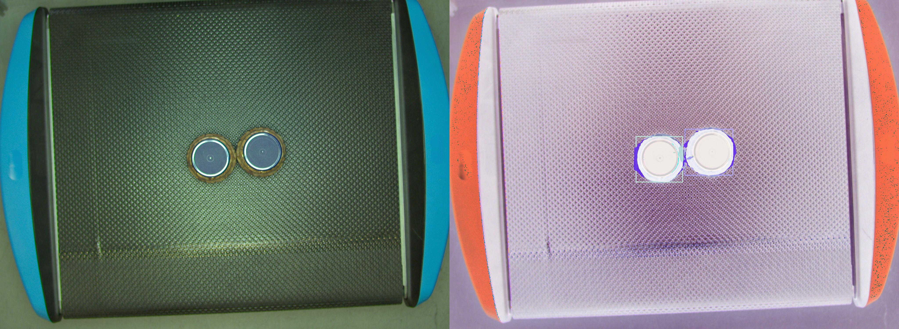
  <br><br>
  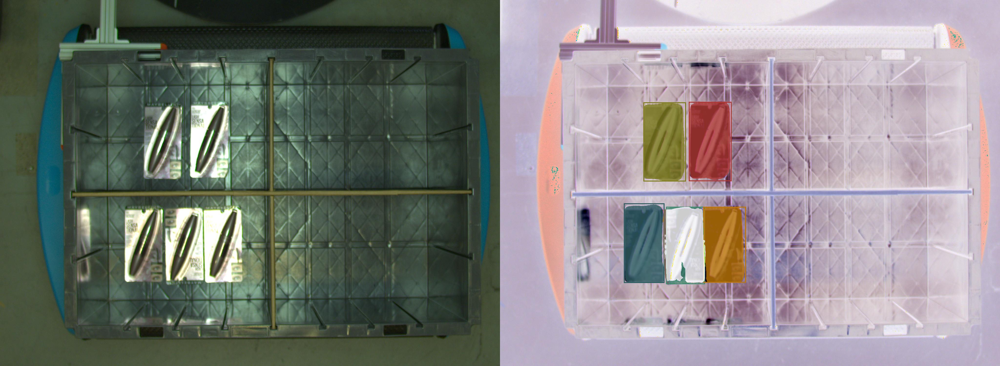
  <br><br>
  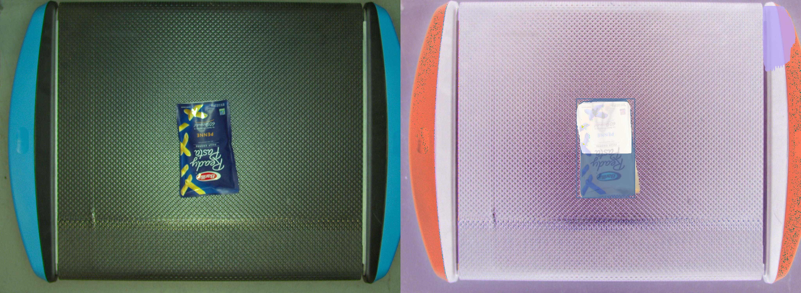
</p>

**DeepLabV3+**
<p align="center">
  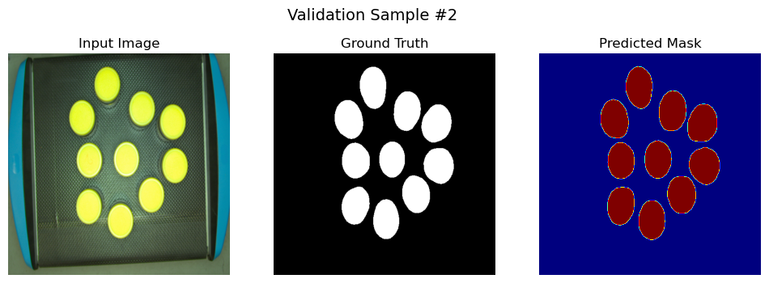
  <br><br>
  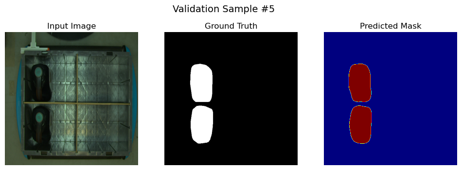
  <br><br>
  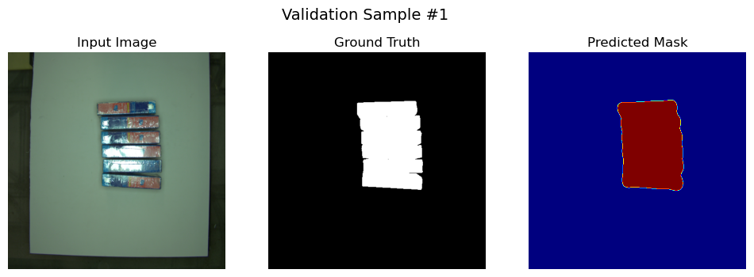
  <br><br>
  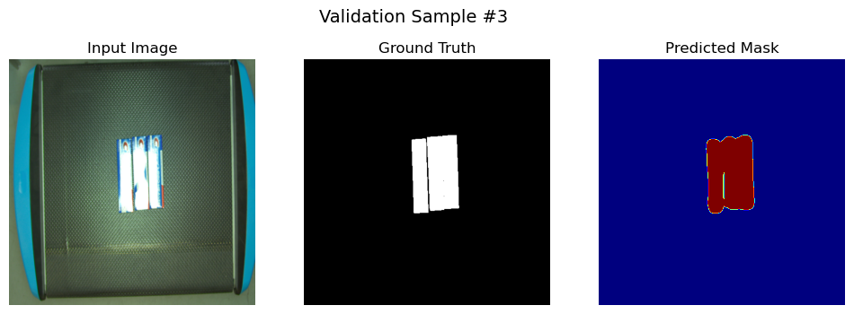
</p>

**RetinaNet**
<p align="center">
  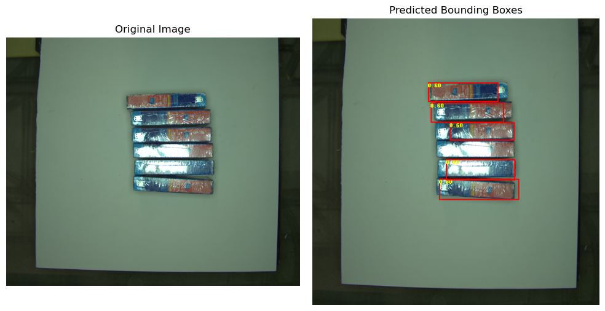
  <br><br>
  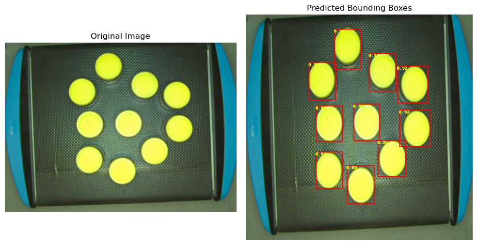
  <br><br>
  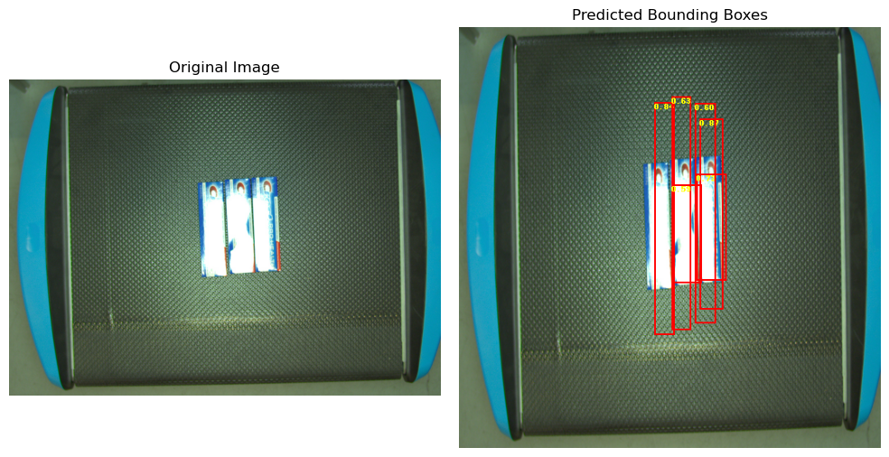
</p>

**YOLOv8**
<p align="center">
  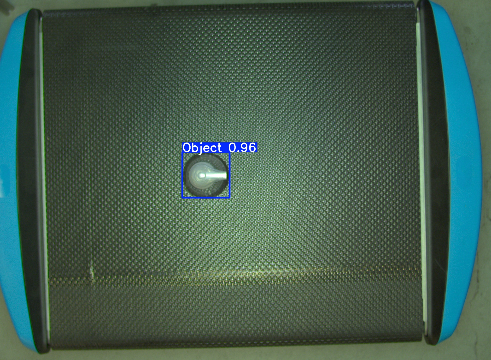
  <br><br>
  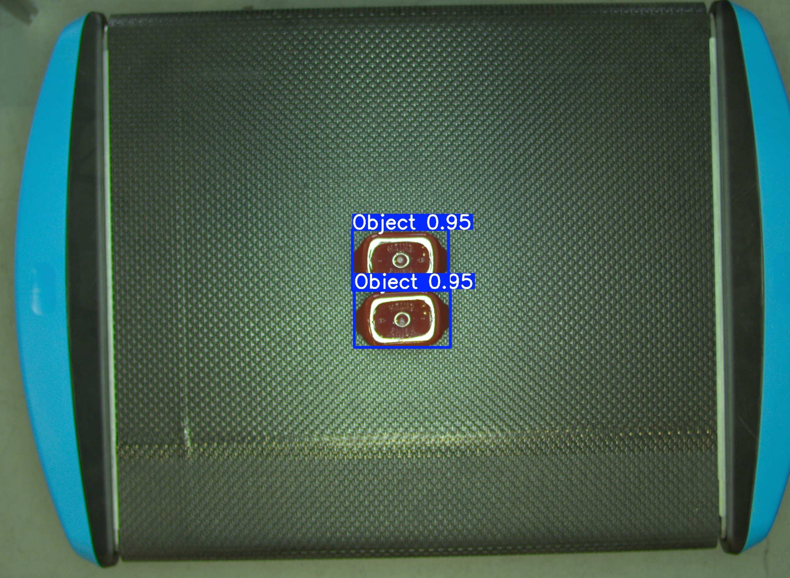
  <br><br>
  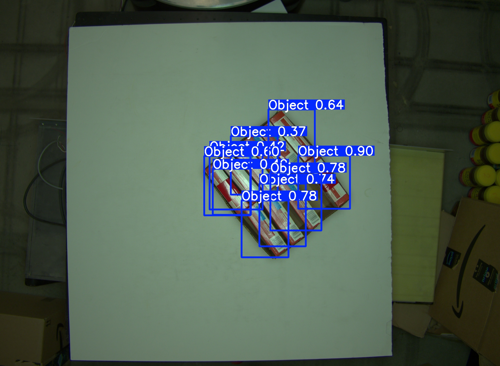
</p>

*(100 YOLOv8 prediction images are available under [`assets/yolov8/outputs/`](assets/yolov8/outputs/).)*

### Key findings

- **Best instance segmentation:** Mask R-CNN with a **ResNet-50** backbone (mask AP 0.854) —
  the best balance of accuracy and generalization; deeper ResNet-101 did not help on the subset.
- **Best semantic segmentation:** DeepLabV3+ — ~96% mIoU, ideal when speed matters more than
  per-instance separation.
- **Best lightweight detection:** YOLOv8 — competitive precision in crowded scenes with fast
  inference, well suited to real-time robotics.
- **Recommended deployment:** Mask R-CNN (ResNet-50) for high-accuracy instance segmentation, or
  DeepLabV3+ (segmentation) paired with YOLOv8 (detection) for low-latency pipelines.

---

## 📁 Repository Structure

```
.
├── models/                     # All model code (notebooks + helper scripts)
│   ├── mask-rcnn/              # Mask R-CNN — instance segmentation (Nithish)
│   │   ├── train_mask_rcnn.py · test_mask_rcnn.py
│   │   ├── engine.py · coco_eval.py · coco_utils.py · utils.py
│   │   ├── resnet18/  mask_rcnn_resnet18.ipynb
│   │   ├── resnet50/  mask_rcnn_resnet50.ipynb   #  ⭐ best model
│   │   └── resnet101/ mask_rcnn_resnet101.ipynb
│   ├── deeplabv3/             # DeepLabV3+ — semantic segmentation (Rahul)
│   │   ├── 1_labelme_to_coco.ipynb
│   │   ├── 2_dataset_class.ipynb
│   │   ├── train_deeplabv3_same_object.ipynb
│   │   ├── evaluate_deeplabv3_same_object.ipynb
│   │   └── train_and_evaluate_deeplabv3_mix_object.ipynb
│   ├── retinanet/             # RetinaNet — one-stage detection (Rahul)
│   │   ├── 1_labelme_to_coco_detection.ipynb
│   │   └── train_and_evaluate_retinanet.ipynb
│   └── yolov8/                # YOLOv8 — real-time detection (Swastid)
│       ├── labelme_to_yolo.ipynb
│       └── train_and_evaluate_yolov8.ipynb
│
├── assets/                     # Images used in this README (per model)
│   ├── mask-rcnn/outputs/
│   ├── deeplabv3/outputs/
│   ├── retinanet/outputs/
│   └── yolov8/outputs/
│
├── docs/                       # Project final report
│   └── Object-Detection-and-Segmentation-on-Amazon-ARMBench_Final-Report.pdf
│
├── README.md
└── .gitignore
```

---

## 🚀 Getting Started

All training and evaluation was run on **Google Colab Pro** (T4 GPUs).

### Requirements

```bash
pip install torch torchvision ultralytics pycocotools \
            opencv-python scikit-image matplotlib tqdm
```

### Running

Each model folder is self-contained and follows the same flow —
**convert annotations → (build dataset) → train → evaluate / visualize**:

1. Obtain the **ARMBench** data and place the relevant subset locally.
2. Open a notebook and update the dataset paths near the top.
3. Run the cells top-to-bottom to convert labels, train, evaluate, and visualize.

| Model | Convert | Train | Evaluate |
|-------|---------|-------|----------|
| Mask R-CNN | (COCO-format ARMBench) | `resnetXX/mask_rcnn_resnetXX.ipynb` | same notebook (uses `engine.py` + `coco_*.py`) |
| DeepLabV3+ | `1_labelme_to_coco.ipynb` | `train_deeplabv3_same_object.ipynb` | `evaluate_deeplabv3_same_object.ipynb` |
| RetinaNet | `1_labelme_to_coco_detection.ipynb` | `train_and_evaluate_retinanet.ipynb` | same notebook |
| YOLOv8 | `labelme_to_yolo.ipynb` | `train_and_evaluate_yolov8.ipynb` | same notebook |

### Model weights

Trained Mask R-CNN checkpoints (`maskrcnn_resnetXX.pt`, ~236–480 MB) are **git-ignored** to keep
the repo light. Keep them locally and load in the corresponding notebook, e.g.:

```python
model.load_state_dict(torch.load("maskrcnn_resnet50.pt", map_location=device))
model.eval()
```

---

## 🔭 Future Work

- Evaluate the trained models on the **Mix-Object-Tote** and **Zoomed-Out-Tote-Transfer** subsets
  to test robustness to clutter, scale, and lighting changes.
- Integrate the best detector + segmenter into a **real-time robotic pipeline** with an object
  classification module for automated pick-and-sort.
- Explore **zero-shot / foundation-model** segmentation (e.g. SAM, DINOv2) for unseen objects.

---

## 📚 References

1. He et al. *Mask R-CNN.* ICCV 2017.
2. Chen et al. *Encoder-Decoder with Atrous Separable Convolution for Semantic Image Segmentation (DeepLabV3+).* ECCV 2018.
3. Lin et al. *Focal Loss for Dense Object Detection (RetinaNet).* ICCV 2017.
4. Jocher et al. *Ultralytics YOLOv8.* 2023.
5. *ZISVFM: Zero-Shot Object Instance Segmentation in Indoor Robotic Environments with Vision Foundation Models.*
6. *STOW: Discrete-Frame Segmentation and Tracking of Unseen Objects.*
7. *Fully Convolutional One-Shot Object Segmentation for Industrial Robots.*

*(Papers 5–7 are the robotics-segmentation works that motivated this study.)*

---

## 🙏 Acknowledgements

Developed as a Computer Vision course project at **Johns Hopkins University, Whiting School of
Engineering**. Thanks to my teammates **Rahul Arutla** and **Swastid Kasture** for their
collaboration. Dataset courtesy of **Amazon ARMBench**.
